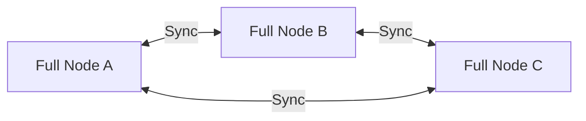

# 🔗 Full Node Blockchain

> **Pesquisa e documentação sobre Nós Completos em redes blockchain**

---

## 📋 Índice

- [O que é um Full Node?](#-o-que-é-um-full-node)
- [Funções Principais](#️-funções-principais)
- [Ciclo de Vida de uma Transação](#-ciclo-de-vida-de-uma-transação)
- [Fichas Técnicas](#-fichas-técnicas)
  - [Bitcoin](#-bitcoin--bitcoin-core)
  - [Ethereum](#-ethereum)
  - [Solana](#-solana)
  - [Polygon](#-polygon)
  - [Stellar](#-stellar)
  - [Kaspa](#-kaspa)

---

## 🎯 O que é um Full Node?

Um **Full Node** (Nó Completo) é um componente fundamental de uma rede blockchain, atuando como um **livro-razão completo e independente** que registra e verifica todas as transações realizadas dentro dessa blockchain.

### 🔑 Características Principais

Esses nós desempenham um papel fundamental na manutenção da segurança e integridade da blockchain:

- ✅ Armazenam todo o histórico da blockchain
- ✅ Garantem que todas as transações sigam as regras estabelecidas
- ✅ Diferem dos nós leves, que mantêm apenas um subconjunto dos dados
- ✅ São indispensáveis para a natureza descentralizada da rede

### 💪 Por que executar um Full Node?

Ao executar um nó completo, indivíduos ou entidades contribuem para a **robustez e descentralização** da blockchain:

| Benefício | Descrição |
|-----------|-----------|
| **Validação** | Validam transações e blocos de forma independente |
| **Propagação** | Retransmitem informações para outros nós |
| **Resiliência** | Fornecem proteção contra falhas da rede |
| **Recuperação** | Podem ajudar a reconstruir a blockchain em caso de falha catastrófica |

> ⚠️ **Nota:** Executar um full node exige poder de armazenamento e processamento significativo, mas garante que a blockchain permaneça segura, transparente e resiliente contra ataques ou falhas.

---

## ⚙️ Funções Principais

### 1️⃣ Armazenar o Histórico Completo

```text
📦 Bloco Genesis → Bloco 1 → Bloco 2 → ... → Bloco Atual
```

- 💾 Mantém todos os blocos desde o bloco genesis até o mais recente
- 📊 Cada bloco contém transações e metadados:
  - Hash do bloco anterior
  - Timestamp
  - Nonce
  - Outras informações
- 🔍 Permite verificar qualquer transação desde o início da rede

### 2️⃣ Validar Transações e Blocos

#### Validação de Transações

Ao receber uma transação, o nó verifica:

- [ ] **Saldo suficiente** - O remetente possui fundos?
- [ ] **Assinatura digital** - A assinatura é autêntica?
- [ ] **Gasto duplo** - Não há *double spending*?

#### Validação de Blocos

Quando um bloco novo chega:

- 🔐 O full node recalcula o hash
- ✔️ Verifica as regras de consenso:
  - Proof-of-Work (PoW)
  - Proof-of-Stake (PoS)
  - Outros mecanismos

### 3️⃣ Propagar Informações



- 🌐 Comunica-se com outros nós (peers)
- 📡 Retransmite transações e blocos válidos
- 🔄 Mantém a rede sincronizada

### 4️⃣ Impor Regras de Consenso

> 🛡️ **Princípio fundamental:** O full node não confia em ninguém

- ⚖️ Aplica as regras do protocolo de forma **independente**
- 🚫 Rejeita blocos inválidos, mesmo que criados por mineradores
- 🎯 Garante a integridade da rede

---

## 🔁 Ciclo de Vida de uma Transação

```text
┌─────────────────────────────────────────────────────────────┐
│                   CICLO DE VIDA DE UMA TRANSAÇÃO             │
└─────────────────────────────────────────────────────────────┘

  1️⃣  Criação
       │
       ├─► 👤 Usuário cria e assina uma transação
       │
       ▼
  2️⃣  Envio
       │
       ├─► 📤 A transação é enviada a um full node
       │
       ▼
  3️⃣  Verificação
       │
       ├─► ✅ O nó verifica e adiciona à mempool
       │
       ▼
  4️⃣  Mineração
       │
       ├─► ⛏️ Mineradores/validadores pegam transações da mempool
       │   e criam um bloco
       ▼
  5️⃣  Propagação
       │
       ├─► 🌐 O bloco é propagado e verificado pelos full nodes
       │
       ▼
  6️⃣  Confirmação
       │
       └─► 🎉 Uma vez aceito, o bloco é adicionado à blockchain
```

---

## 📚 Fichas Técnicas

Esta seção contém fichas técnicas detalhadas dos principais Full Nodes de diferentes redes blockchain.

### 📁 Estrutura de Diretórios

```tree
juciley-costa/
├── bitcoin/
│   └── bitcoin-core-ficha-tecnica.md
├── ethereum/
│   ├── geth-ficha-tecnica.md
│   ├── erigon-ficha-tecnica.md
│   └── besu-ficha-tecnica.md
├── solana/
│   └── solana-validator-ficha-tecnica.md
├── polygon/
│   └── polygon-ficha-tecnica.md
├── stellar/
│   └── stellar-core-ficha-tecnica.md
├── kaspa/
│   └── kaspa-ficha-tecnica.md
└── README.md
```

---

### 🟠 Bitcoin — Bitcoin Core

Bitcoin Core é o full node de referência do ecossistema Bitcoin: robusto, seguro e mantido por uma comunidade ativa. É a escolha natural quando se precisa de máxima compatibilidade, segurança e independência da rede. 

Exige investimento em armazenamento e I/O (NVMe/SSD recomendado) e configuração de segurança para RPC. Não é a solução para throughput elevado (essa limitação é parte do design do protocolo), mas é excelente como camada base para serviços de custódia, auditoria e infraestrutura de pagamentos.

**📄 Arquivo:** [`bitcoin/bitcoin-core-ficha-tecnica.md`](./bitcoin/bitcoin-core-ficha-tecnica.md)

---

**📚 Pesquisa realizada por:** Juciley Costa  
**📅 Última atualização:** Outubro 2025

---

*Contribuindo para o conhecimento descentralizado* 🚀
